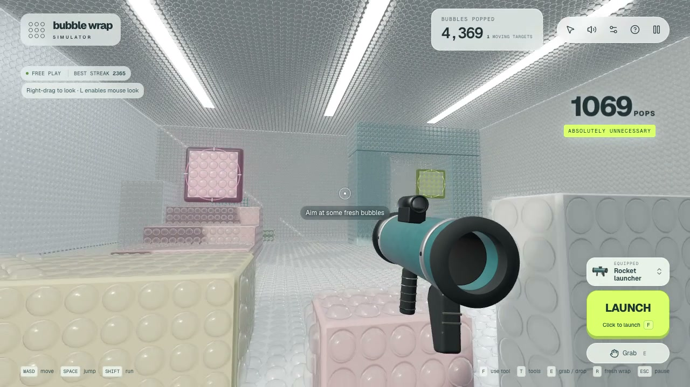

# Bubble Wrap Simulator

A first person Three.js playground built around the extremely reasonable desire to pop an entire room of bubble wrap.

**[Play in your browser](https://bubble-wrap-simulator.vercel.app)** · **[Watch the gameplay video](docs/gameplay.mp4)**

[](docs/gameplay.mp4)

Nine tools. Three moving targets. A room with more than 43,000 bubbles. Built with React, Three.js, Rapier physics, Blender models, and synthesized Web Audio. Plays on desktop, phones, and tablets.

## Play

Enter the arena, look at the wrapped block directly ahead, and click the large **POP** button or press **F** for your first pop. On a phone, a short tap on the arena also uses the equipped tool; drag to look around. Explore the wrapped room, stairs, arch, platforms, loose parcels, and three moving pop targets. All nine tools are available immediately.

| Control | Action |
| --- | --- |
| WASD | Move |
| Right-drag / arrow keys | Look while keeping your cursor available |
| L | Toggle optional captured mouse look |
| Space | Jump |
| Shift | Run |
| On-screen action button / F / left mouse | Use the selected tool |
| Hold, then release left mouse | Charge and throw a bowling ball or held object |
| Grab button / E | Pick up or drop a nearby loose object |
| Q | Drop a held object |
| 1–9 / mouse wheel | Change tools |
| Equipped-tool button / T | Open the tool picker; choosing a tool resumes play |
| R | Reinflate the room and restore objects |
| Sound button | Mute / unmute |
| Esc | Pause and release the mouse |

Phones and tablets have safe-area-aware portrait and landscape layouts, a movement stick with a center dead zone, drag-to-look across the arena, and large jump, grab, and action buttons. The tool picker is integrated above the action button and stays collapsed during play. Drag on the action button to aim while firing. Independent fingers can move, aim, and fire together; a drag, long press, or cancelled gesture never turns into an arena tap. Cancelled charged throws do not launch. Rotating the device pauses the game. Settings include volume, sensitivity, camera shake, footstep popping, and rendering quality. Only preferences persist in local storage.

| New tool | How to play |
| --- | --- |
| Rocket launcher · 7 | Tap **LAUNCH**. A finned rocket leaves orange sparks and bursts on impact, throwing props and sending a pop wave through nearby wrap. One-second recovery between rockets. |
| Bowling cannon · 8 | Tap or hold **BOWL** to send seven-kilo balls bouncing through the room. Aim above distant targets to account for gravity. |
| Pop vacuum · 9 | Hold **VACUUM** and sweep across nearby wrap and loose props. Teal air rings contract toward the nozzle as objects gather in front of you; release to let the pile fall. Walls block suction. |

## Run locally

Requires Node 22.13 or newer.

```sh
git clone https://github.com/finktheartist/bubble-wrap-simulator.git
cd bubble-wrap-simulator
npm ci
npm run dev:standalone
```

Open the local URL printed by the server. This standalone entry needs no accounts, environment variables, database, or API keys. Audio begins with the Enter button; optional mouse capture requires a browser user gesture, but tool use never requires capture. The app needs WebGL2 and WebAssembly.

```sh
npm test
npm run typecheck
npm run lint
npm run build:vercel
npm run preview:vercel
```

## Implementation

### Standalone Vercel build

```sh
npm run build:vercel
npm run preview:vercel
```

This builds the same React interface, game engine, nine models and local Geist fonts into `outputs/vercel/site/`. It needs no server, database, API key or Sites sign-in. The existing `npm run build` command continues to produce the Sites version. `outputs/vercel/manifest.json` records every deployable file's size and SHA-256.

Deploy the generated `outputs/vercel/site` directory to your own Vercel project using the **Other** framework preset. The staged `vercel.json` disables install and build steps because the directory is already built. Its configuration serves hashed assets with immutable caching and revalidates model filenames, so future model updates do not leave stale tools in the browser. Only the playable web assets are deployed; the Blender source library stays in this repository.

The original Sites integration remains available through `npm run dev` and `npm run build`.

The static entry is in `platform/vercel/`; its Vite configuration is `vite.vercel.config.ts`. Tool portraits are already-rendered data URLs, so native image elements work without an image-optimization server.

Bubble spacing is 0.26 world units throughout the room and 0.22 on loose parcels, down from 0.62 and 0.4. Smaller per-cell geometry and deduplicated pop waves keep the denser wrap bounded.

- Three.js renders clear, nonmetallic packing film over the colored backing. Instanced molded pockets taper into broad heat-welded lips; physical transmission, fine film normals, restrained clearcoat, and panel reflections make the air pockets readable. Continuous backing sheets carry grain and contact shading. Popping blends each pocket into a folded empty shape with matching normals, while reinflation restores it. Neutral studio lighting, overhead area lights, and soft shadow filtering ground the room. Balanced quality reduces the transmission-buffer resolution; high quality restores full resolution.
- Rapier provides a fixed 60 Hz rigid-body simulation, a capsule character controller, gravity, contact events, object mass, friction, restitution, continuous collision detection, and collision-preserving object grabbing.
- Bowling balls, parcels, pellets, bombs, and rockets are dynamic bodies. Contact position and impact speed determine pop radius. Rockets maintain their flight orientation with gravity disabled, record contacts during collision dispatch, and detonate after the physics step. Misses expire after 3.5 seconds. Explosions apply distance-based impulses and schedule outward-moving crackles. The vacuum uses a damped, mass-independent pull within an eight-unit cone, checks occlusion, and preserves rigid collisions.
- Hammer and bat attacks pivot around the grip, with distinct wind-up, strike, follow-through, and recovery poses. A short tap commits the whole swing; hits land at the visible contact time, and a rapid follow-up tap can buffer one swing. A brief trail follows the actual tool tip, with a soft movement sound and reticle feedback on contact.
- Three bubble targets move on kinematic paths, keeping their rendered wrap and collision bodies synchronized. Popping twelve bubbles scores a target hit; the target reinflates after 3.2 seconds. Air ripples, film flecks, shot streaks, muzzle flashes, and target bursts use bounded pools; phones allow at most 180 effect fragments.
- Web Audio synthesizes rounded pressure pops with a short, warm membrane body and a softly filtered air transient. There are no crinkle tails, distortion, or added room echoes. Twenty-four variants and stereo placement provide variation; dense impacts resolve into distinct pops spaced 20–28 ms apart. Conservative voice gain, a short queue, filtered treble, and a gentle limiter prevent harsh stacking. Impact thumps are quieter and rate-limited. No audio assets or external services are needed during play.
- Nine Blender-authored GLBs supply the held tools: a connected suede glove, rubber-barrel mallet, maple bat, drilled resin bowling ball, machined pneumatic sidearm, enamel bomb, hollow teal rocket launcher, red bowling cannon with a pressure gauge, and yellow vacuum with a corrugated throat and open nozzle. Each embeds baked color and normal maps while retaining distinct PBR material responses. The complete set is about 8.3 MB; meshes and textures are shared by held tools, portraits, and thrown instances. Small finned rockets use a separate lightweight flight mesh with owned, deduplicated GPU resources.
- Mobile rendering uses 10-segment bubble pockets without changing cell counts, 1× balanced pixel density, a 45% transmission buffer, and at most 24 projectiles. Paused scenes redraw at 10 Hz; hidden tabs skip rendering.
- Menu icons are transparent portraits rendered once from the same Three.js models and materials used by the held tools. Shapes, colors, grips, and bowling-ball finger holes match the items in the arena.
- GPU instancing, bounded projectiles, bounded particles, and a balanced render setting keep the room practical for a browser.

The wrap itself uses a hybrid approximation: rigid backing plus individually animated cells. It does not simulate tearing sheets, cloth, or air pressure. The tools are playful sandbox objects.

## Validation

Thirty-five automated tests cover all nine tool actions, mouse/keyboard/touch gesture ownership, timed melee contact, buffered swings, moving targets, wrap reinflation, audio headroom, player movement, high-speed collisions, grabbing, blast falloff, and reset. The expansion checks actual rocket contact and deferred one-time detonation, missed-rocket cleanup, cannon mass and held-fire behavior, vacuum activation/cancellation, bounded suction and wall occlusion, the phone VFX budget, and alignment of world effects with the separate held-tool camera. Asset checks parse shipped GLBs for finite geometry, UVs, triangle budgets, real bowling-ball wells, embedded textures, and shared-resource disposal. Actual new-tool vertices are projected into phone, tablet, square, and desktop views at rest and during recoil to check framing and reticle clearance.

The nine GLBs are re-imported and rendered in Blender to inspect exported materials and silhouettes. Desktop and phone swing poses, plus the new tools in desktop, portrait, and landscape, are rendered using matrices sampled from the actual game pose function. TypeScript checks the full project. Lint checks application, game, and test sources; the untouched generated component catalog has pre-existing lint failures and is outside that command.

The [gameplay recording](docs/gameplay.mp4) uses the actual browser build, physics, UI, and game audio, with scripted camera direction and tool inputs. Touch controls have automated coverage but have not yet been verified on a physical device.

## Architecture

- `app/page.tsx`: game HUD, tool belt, pause and settings UI, touch input.
- `lib/game/game.ts`: game loop, input, targeting, impacts, pop waves, and effects.
- `lib/game/arena.ts`: room geometry, lighting, continuous backing sheets, and bubble instance state.
- `lib/game/plastic.ts`: molded and folded pocket geometry, procedural film maps, physical plastic shader, and reflection environment.
- `lib/game/physics.ts`: Rapier bodies, character movement, grabbing, and impulses.
- `lib/game/melee.ts`: committed melee attacks and grip-pivot poses.
- `lib/game/targets.ts`: reusable moving targets and reward/reinflation state.
- `lib/game/effects.ts`: bounded world effects, swing trails, and muzzle flash.
- `components/game/tool-picker.tsx`: collapsed equipped-tool control and accessible picker.
- `lib/game/tools.ts`: GLB loading, tool instances, and ownership of shared GPU resources.
- `lib/game/tool-info.ts`: shared lightweight catalog, action labels, and keyboard shortcuts.
- `lib/game/projectiles.ts`: finned rocket flight model.
- `public/models/`: nine self-contained GLBs and their asset budget manifest.
- `art/bubble-wrap-tools.blend`: editable model library and product studio; see [asset workflow](art/README.md).
- `tools/blender/`: repeatable modeling, baking, export, and exported-asset review scripts.
- `lib/game/touch.ts`: pointer ownership, stick dead zone and touch look scaling.
- `components/game/touch-controls.tsx`: independent look and movement controls.
- `lib/game/audio.ts`: procedural sound routing.
- `lib/game/tool-icons.ts`: menu portraits rendered from the live tool models.
- `lib/game/pop-synthesis.ts`: pressure-release synthesis and voice scheduling.
- `lib/game/input.ts`: tool input with or without mouse capture.
- `components/game/use-tool-button.tsx`: pointer and keyboard action button.

API references: [Three.js](https://threejs.org/docs/), [Rapier](https://rapier.rs/docs/user_guides/javascript/getting_started_js/).
